# vulcan-o-bot

Discord bot client for vulcan uonet+ register

## Usage

To log in type in dm: `?login email password symbol`. For example:
`?login email@gmail.com password123 warszawa` or
`?||login email@gmail.com password123 warszawa||`

## Available commands

If you ever forget a command, use ?help

### Category vulcan:

#### login

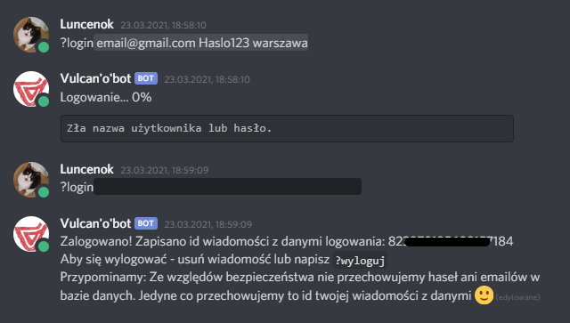

#### logout


#### exams

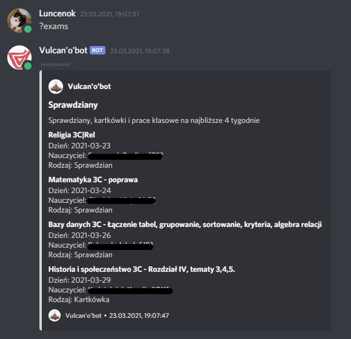

#### grades

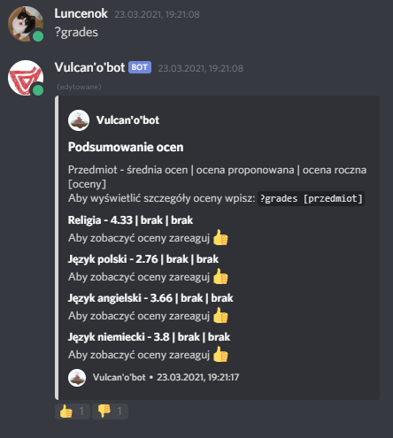
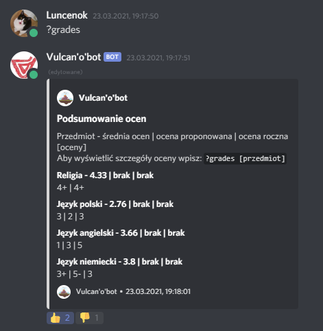

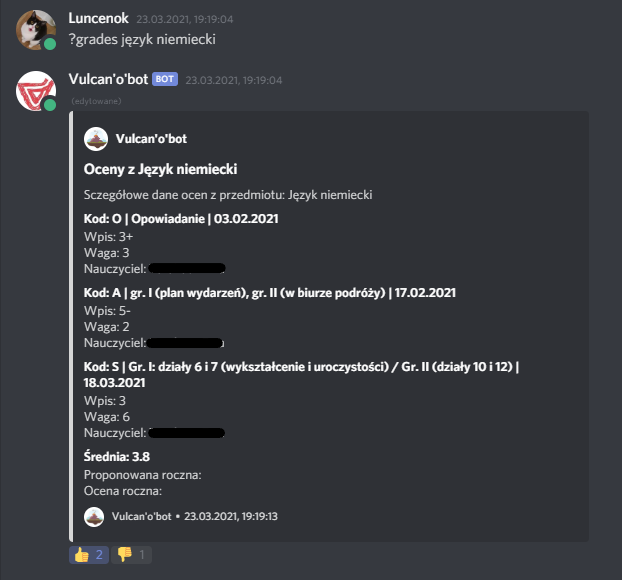

#### homework

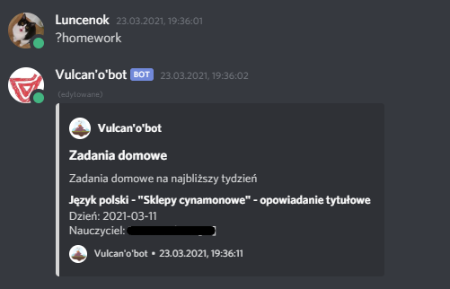

#### luckynumber

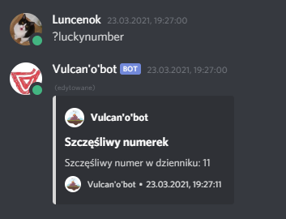

#### status

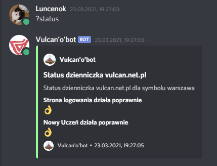

#### timetable

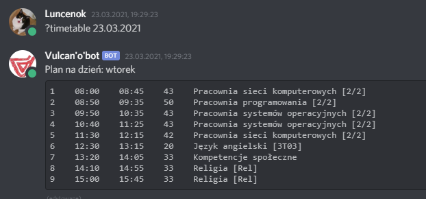

### Category other:

#### help

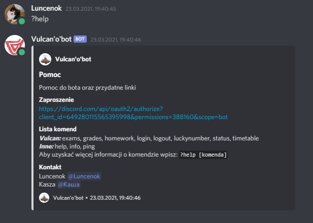

#### info

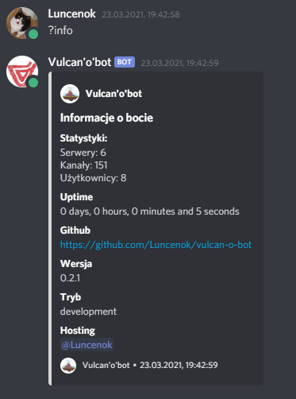

#### ping


### develop (only for bot owner):

#### reload

to get more info about specified command please type: `?help command`. For example: `?help login`

## Installation

Install dependencies

```
yarn install
```

Run bot requires environment variables. See example environment variables [here](.env.example)

```
yarn run development
```

## License

The code of this project is licensed under MIT.
